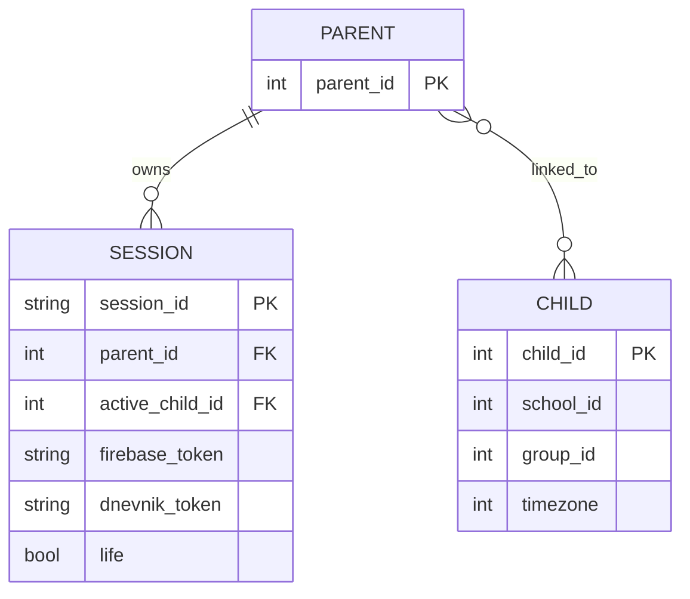
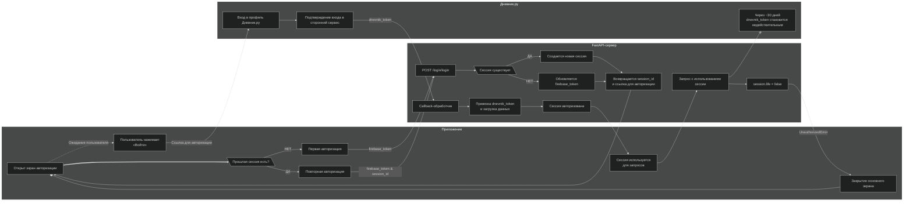
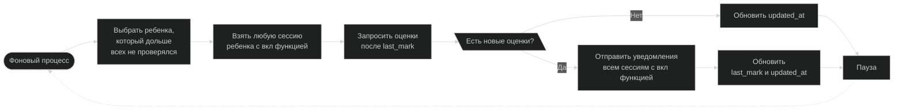
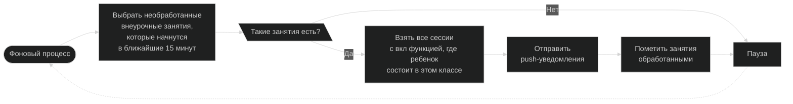
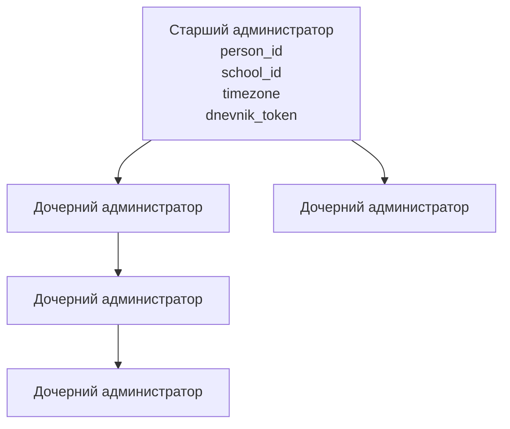

# 📖 Документация
Краткая информация о работе серверной части приложения, об основных сущностях, процессах и взаимодействиях между ними

## Основные сущности



### Parent

Представляет человека, использующего приложение.

`parent` не хранит данные и существует только как постоянный идентификатор пользователя. Его идентификатор совпадает с `person_id`, полученным от Дневника.ру.

Если пользователь является учащимся, то создаются одновременно:

* `parent(parent_id = person_id)`
* `child(child_id = person_id)`

Поэтому условие
```text
parent_id == child_id
```
означает, что пользователь сам является ребенком.

---

### Child

Представляет профиль ребенка.

Именно `child` содержит данные, полученные из Дневника.ру:

* school_id
* group_id
* timezone

У одного родителя может быть несколько детей.

У одного ребенка может быть несколько родителей или других законных представителей.

Поэтому между `parent` и `child` используется неявная связь **многие-ко-многим**.

---

### Session

Представляет конкретный экземпляр приложения на конкретном устройстве.

Каждая сессия всегда принадлежит ровно одному `parent`.

При этом она содержит изменяемые параметры:

* firebase_token
* dnevnik_token
* active_child_id
* life

Повторная авторизация сессии изменяет только ее связь с Дневником.ру и FCM (`dnevnik_token`, `firebase_token`) и при необходимости синхронизирует список детей. Также возможно создание новой сессии на том же устройстве, но с настройками по умолчанию

#### Как создается, авторизуется, работает и деактивируется сессия пользователя?


## Три уровня идентификаторов

| Идентификатор | Что представляет                 | Когда используется                                                                                                  |
| ------------- | -------------------------------- |---------------------------------------------------------------------------------------------------------------------|
| `parent_id`   | человек, использующий приложение | статистика, отзывы, реферальная программа, настройки пользователя; любые действия, зависящие только от пользователя |
| `child_id`    | профиль ребенка                  | заметки, рейтинг в классе                                                                                           |
| `session_id`  | конкретное устройство            | push-уведомления, серверный кэш, логи, авторизация                                                                  |

> Один пользователь (`parent`) может пользоваться приложением на нескольких устройствах (`session`) и работать с несколькими профилями (`child`), свободно переключаясь между ними.

---

## Общая работа уведомлений
> Все push-уведомления отправляются фоновыми процессами.
>
> Получателями уведомлений являются сессии, а не пользователи. Поэтому каждая функция с уведомлениями работает с session_id. Настройка таких функций зависит от каждого устройства пользователя. Если пользователь использует приложение на нескольких устройствах, уведомления будут отправлены на те устройства, где функция включена.
>
> Для отправки используется firebase_token, принадлежащий соответствующей сессии.

### Новые оценки (marks_notifications)


1. Для обработки выбирается ребенок, имеющий минимальное значение `updated_at`.
2. Используется `dnevnik_token` любой активной сессии этого ребенка (выбирается случайно).
    > Для получения новых оценок достаточно любого действительного dnevnik_token, принадлежащего ребенку. Поэтому запрос в Дневник.ру выполняется один раз независимо от количества устройств пользователя.
3. Запрашиваются оценки, выставленные после `last_mark`.
4. Если новые оценки обнаружены, уведомления отправляются всем сессиям с включенной функцией.
5. После обработки:
   * обновляется `updated_at`;
   * при наличии новых оценок обновляется `last_mark`.
6. После небольшой задержки процесс переходит к следующему ребенку.
    > Интервал между проверками рассчитывается таким образом, чтобы каждый ребенок был обработан не реже одного раза в 10 минут.

---

### Напоминания о внеурочных занятиях


1. Выбираются все необработанные внеурочные занятия, которые начнутся в ближайшие 15 минут.
2. Для каждого занятия определен класс (учебная группа) по идентификаторам `school_id` и `group_id`.
3. Находятся все сессии с включенной функцией, у которых связанный `child` обучается в соответствующем классе (учебной группе) по идентификаторам `school_id` и `group_id`.
4. Каждой сессии отправляется push-уведомление с использованием ее `firebase_token`.
5. После успешной отправки занятие помечается как обработанное и больше не участвует в последующих проверках.
6. После небольшой задержки фоновый процесс повторяет цикл.

---

## Администрирование образовательных организаций



### Старший администратор

Создается после успешной авторизации через Дневник.ру.

Хранит:

* `person_id`;
* `school_id`;
* `timezone`;
* `dnevnik_token`.

Именно эти данные используются при выполнении всех операций, требующих доступа к Дневник.ру.

### Дочерний администратор

Создается уже существующим администратором.

Хранит только:

* собственный Telegram `user_id`;
* имя;
* `parent_admin_id`.

Все остальные данные (`person_id`, `school_id`, `timezone`, `dnevnik_token`) наследуются от старшего администратора дерева.
> Независимо от глубины вложенности, любая операция всегда выполняется от имени старшего администратора соответствующего дерева.

### Выполнение административной операции

1. Администратор выполняет действие в Telegram-боте.
2. Определяется старший администратор, которому принадлежит данный пользователь.
3. Используются `person_id`, `school_id`, `timezone` и `dnevnik_token` старшего администратора.
4. Проверяется действительность `dnevnik_token`.
5. Если токен действителен — операция выполняется.
6. Если токен недействителен — возвращается ошибка авторизации.
7. Старшему администратору необходимо повторно пройти авторизацию через Дневник.ру.
